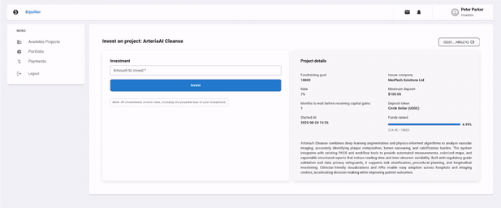

[](https://github.com/icolomina/equillar/actions/workflows/ci.yml) [](https://www.gnu.org/licenses/agpl-3.0) [](https://github.com/icolomina/equillar/releases)

# Equillar

**Learn Blockchain Development with Open Source**

An open-source platform powered by PHP, Symfony, React, and Soroban smart contracts. Learn blockchain development with ready-to-run local code, or use it as a technical foundation for your organization to build upon.



# What is Equillar?

Equillar is a complete, open-source blockchain application that serves dual purposes:

1. **Educational Resource**: Learn how to build real-world blockchain applications by exploring, running, and modifying working code
2. **Technical Foundation**: Use it as a starting point for prototyping and experimenting with blockchain-based solutions in a local/test environment

Built as an investment platform on the [Stellar](https://stellar.org/) blockchain using [Soroban](https://stellar.org/soroban) smart contracts, Equillar demonstrates how to integrate distributed ledger technology with modern web applications. All contracts are deployed on the [Soroban testnet](https://developers.stellar.org/docs/build/smart-contracts/getting-started/deploy-to-testnet), making it perfect for learning and experimentation.

> **Important**: Equillar is designed for education and prototyping, not for production use. It provides a tech stack for learning and building blockchain applications in controlled environments. Read the [LEGAL](./LEGAL.md) advice for more info.

# License

This project is licensed under the GNU Affero General Public License v3.0 (AGPL-3.0). See the [LICENSE](./LICENSE) file for details.

# Why Equillar?

## For Learning Blockchain Development

- **Complete, working codebase**: Explore a full-stack application integrating blockchain technology from end to end
- **Smart contract integration**: Learn how to interact with Soroban contracts from a web application
- **Modern tech stack**: Experience real-world development with PHP/Symfony, React/TypeScript, and blockchain technology
- **Hands-on experimentation**: Run locally with Docker, modify code, and see results immediately
- **Well-documented**: Clear folder structures and comprehensive documentation to guide your learning journey

## As a Technical Foundation

- **Ready-to-fork**: Clone and customize for your organization's specific prototyping needs
- **End-to-end architecture**: Backend (Symfony + PHP) and frontend (React + TypeScript) fully integrated
- **Extensible design**: Modular architecture makes it easy to add features or modify existing ones
- **Test environment**: Safe testnet deployment for experimenting with blockchain features
- **Real implementation patterns**: Learn from production-quality code organization and best practices

## Key Features to Explore

- **Blockchain wallet integration**: See how Freighter wallet connects to Soroban contracts
- **Transaction handling**: Learn how to simulate, sign, and submit blockchain transactions
- **Smart contract interaction**: Understand contract deployment, invocation, and error handling
- **Modern UI/UX**: Material UI components and React patterns for blockchain applications
- **Database integration**: See how blockchain data syncs with traditional databases (PostgreSQL)
- **User flows**: Complete investor and company dashboards demonstrating real-world scenarios

# What You'll Learn

Through Equillar's investment platform example, you'll discover:

- How to integrate smart contracts with web applications
- Blockchain transaction lifecycle management
- Wallet connectivity and user authentication
- Handling contract errors and edge cases
- State management between blockchain and traditional databases
- Building user interfaces for blockchain interactions
- Testing blockchain applications locally

# Technology Stack

- **Backend**: PHP 8.3+, Symfony 7.x
- **Frontend**: React 18+, TypeScript, Material UI
- **Blockchain**: Stellar, Soroban smart contracts (Rust)
- **Database**: PostgreSQL
- **Build Tools**: Webpack Encore, Symfony UX
- **Deployment**: Docker Compose

See the full [Tech Stack](docs/tech-stack.md) documentation for details.

# Quick Start

Get Equillar running locally in minutes:

```bash
# Clone the repository
git clone https://github.com/icolomina/equillar.git
cd equillar

# Start with Docker Compose
docker-compose up -d

# Install dependencies and set up the database
# (See full installation guide for details)
```

For complete installation instructions, see the [Installation Guide](docs/installation.md).

# Documentation

- [Installation](docs/installation.md) - Complete setup guide
- [Soroban Contract](docs/contract.md) - Understanding the smart contracts
- [Freighter Wallet](docs/freigther-wallet.md) - Wallet integration guide
- [Exploring the Dashboard](docs/exploring_the_dashboard.md) - Platform features walkthrough
- [Tech Stack](docs/tech-stack.md) - Technology overview
- [Backend Folder Structure](docs/backend-folder-structure.md) - Backend code organization
- [Frontend Folder Structure](docs/frontend-folder-structure.md) - Frontend code organization
- [Handling Contract Errors](docs/handling-contract-errors.md) - Error management patterns

# Use Cases

## For Students and Developers
- Learn blockchain development with a complete, working example
- Understand smart contract integration patterns
- Experiment with blockchain features in a safe environment
- Build your portfolio with blockchain projects

## For Organizations
- Prototype blockchain solutions quickly
- Evaluate Stellar/Soroban technology for your use case
- Use as a foundation for hackathons or internal projects
- Train your team on blockchain development

## For Educators
- Teaching material for blockchain courses
- Real-world example for technical workshops
- Reference implementation for blockchain concepts

# Contributing

We welcome contributions from the community! Whether you're:
- Fixing bugs or improving documentation
- Adding new features or examples
- Suggesting improvements to the learning materials
- Sharing how you've used Equillar in your projects

Please read our [CONTRIBUTING guidelines](CONTRIBUTING.md) before submitting issues or pull requests.

# Community & Support

For questions, ideas, or support:
- **Issues**: Report bugs or request features via [GitHub Issues](https://github.com/icolomina/equillar/issues)
- **Discussions**: Ask questions or share ideas in [GitHub Discussions](https://github.com/icolomina/equillar/discussions)
- **Learning**: Check our documentation and explore the code

# Roadmap

See our [ROADMAP](ROADMAP.md) for planned features and improvements.

---

**Start your blockchain development journey today!** Clone Equillar, explore the code, and learn by doing.