## Exploring the dashboard

### The login page
After you click to the url "http://127.0.0.1:8000/app", you will see the typical Login form so that you can log into the app. 

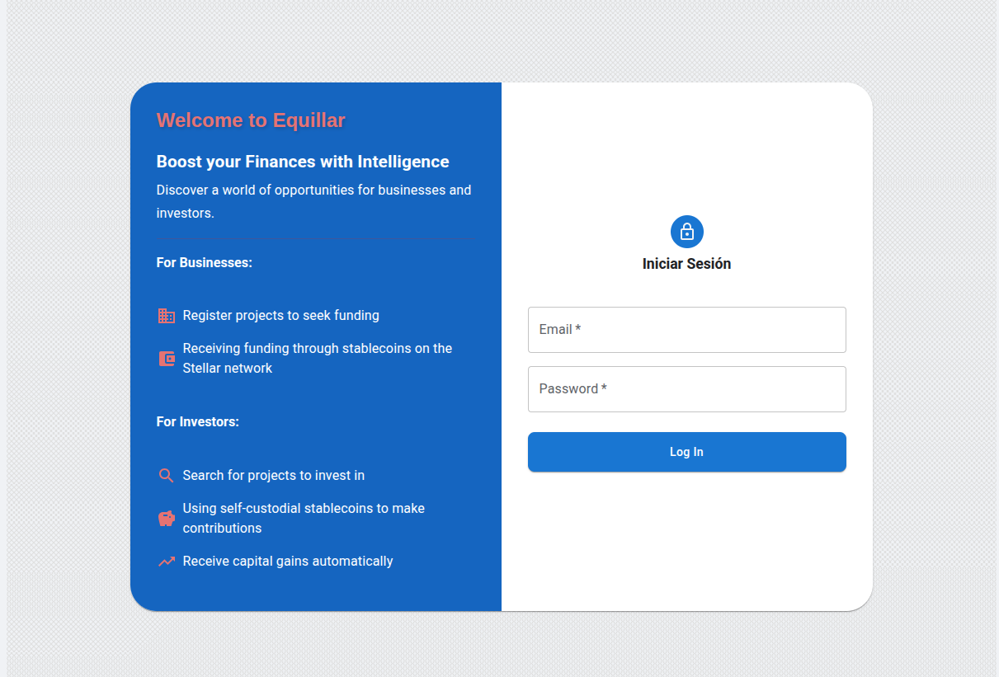

> At the moment, we don't have a registration form, so you have to use the users registered in the Doctrine "Fixture" files which have been loaded during the docker container building process. 

Let's start by logging into the app as a company user. To do that, user the credentials: *medtech@company.com / company2*. 

### The company projects list

After logging as a company, you will be redirected to its projects list. As there are no projects yet, you will see a button for creating a new project. 

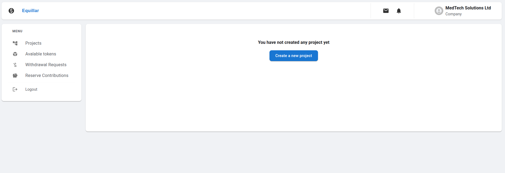

### The create project form

If you click on the "Create Project" button, you will be redirected to a page which renders a form for creating it. 

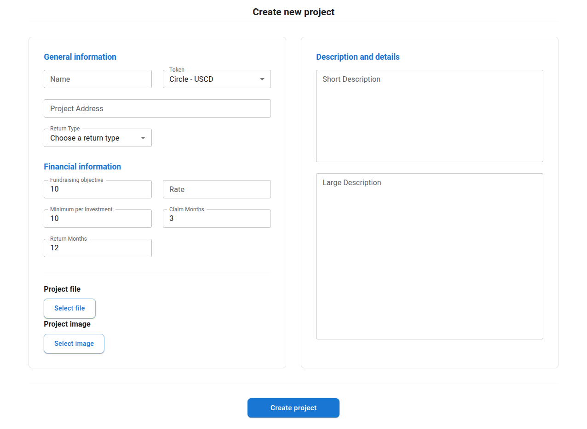

Let's describe the fields one by one:

#### General Information

- **Name**: The name of the project
- **Token**: The Stellar token required by the project by which the investors will have to send their transfers. At the moment, this app accepts the USDC and EURC tokens deployed on Soroban Testnet.
- **Project Address**: The Stellar Address where the company will receive the withdrawals. If the company request a withdrawal to start its project, the transfer will be sent to that address.
- **Return type**: It is the way by which the investors will receive the capital gains. The are two elegible ways:
   - **Coupon**: It works in the same way as a Treasury bond coupon: you receive interest payments every month, and in the final month, you receive both the last interest payment and the principal amount.
   - **Reverse Loan**: The capital contributed plus the interests is divided by the number of months during which payments will be made and that amount is sent to the investor each month.

#### Financial Information

- **Fundraising objective**: Fundraising goal set by the company. 
- **Rate**: The interest rate that the company offers to the investors.
  
At this point, it is essential to clarify how the interest received by investors is calculated. For instance, if an investor contributes $1,000 and the company offers an interest rate of 5%, the investor will receive a total of $1,050 based on one of the payment strategies outlined in the 'Return Rate' section. It is important to note that this is not annualized interest; rather, it is calculated solely based on the initial capital and the interest rate.

- **Minimum per investing**: The minimum capital to be able to invest
- **Claim months**: The length of time (in months) during which the investment will remain locked. After this time, payments will begin to be issued to investors.

The duration of the lock-up period should be correlated with the interest rate. Specifically, if the company establishes a longer lock-up period before distributing profits to investors, the interest rate offered should be correspondingly higher to incentivize investors to commit their capital.

- **Return months**: The number of months over which profits will be distributed to investors once the lock-up period has ended.

#### Description and details

- **Short description**: A short description of 2 or 3 lines. It will be displayed to the investor in the list of projects in which they can invest.
- **Large description**: A large description of 5 or 6 lines. It will be displayed to the investor after it clicks on the project to explore more information.

#### Project file

A Pdf file with the project memory and documentation. This file will be used by the platform administrators to decide to approve or reject the project.

#### Project image

A project image (jpg or png)

### The project information page

Fill the fields with the values you consider and click on the save button. After that, you will be redirected to the contract information page.

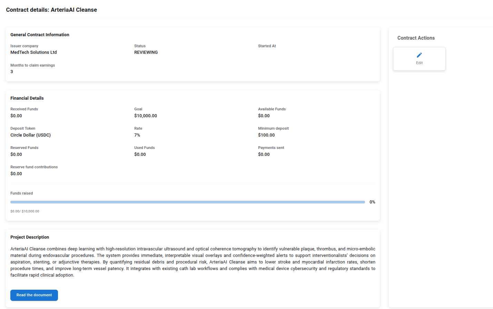

This page displays the data you entered into the form and indicates that the contract is currently in 'REVIEWING' status, which means it is under evaluation. Additionally, there is a 'Contract Actions' section. After creating the contract, the only action available to the company is to edit the contract details. By clicking this button, you will be redirected to the contract form, pre-filled with the current contract data, where you can make any necessary changes.

As the company cannot approve the contract, let's logout and log-in again but with the administrator credentials. You can logout by clicking in the "Logout" link in the side menu.
To log-in as an administrator, use the following credentials: *support@admin.com / admin*.

After logged you will see a list of the current projects available in the platform (only one so far). Click on the "More Info" button so that you access the contract information. You can see now the same contract information page as before but now there are two actions instead of one. As the administrators can approve contracts, let's approve it by clicking in that button. You will see the following modal dialog:

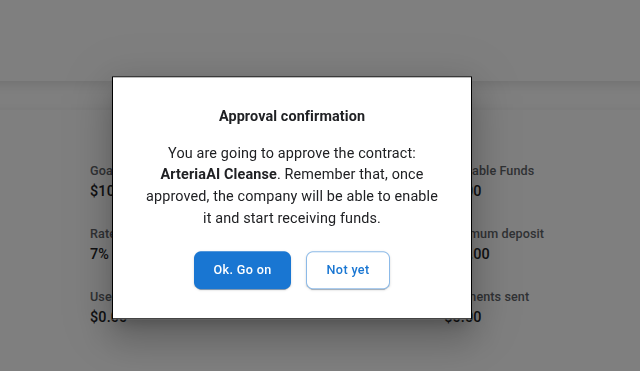

If you decide to approve the contract, you only must click on the "ok. Go on" button and the contract will change to the "APPROVED" status. After the process finished, you will see the following modal:

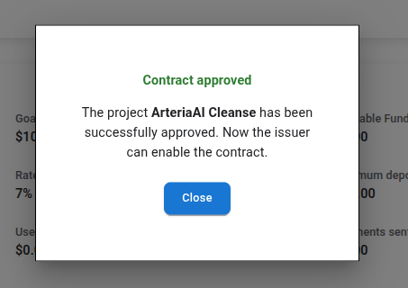

Now it's time to log-in as company again and activate the contract. Use the same company credentials as before and, after login, you will see a project list with the project you've been created which it's already APPROVED. Click on the "More Info" button.

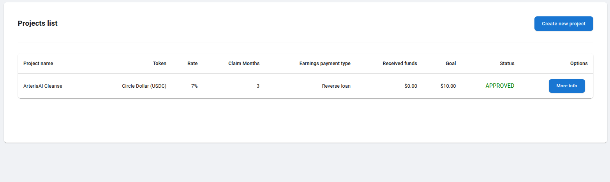

This time, the contract information page contains a new action: "Activate". This action allows us to deploy the contract to the Stellar blockchain and start receiving funds. Let's activate it by clicking in that action button. You will see the following modal:

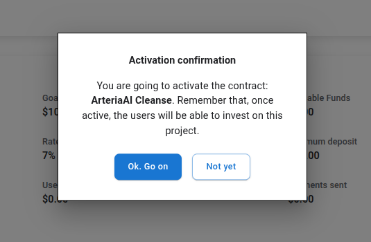

Click on the "Go on" button and the modal will show a loader informing that the contract is currently being deployed. After the process finishes, the modal shows a confirmation message and a "Close" button. Close the modal and the contract information edition page will be reloaded. Let's see how it looks like now:

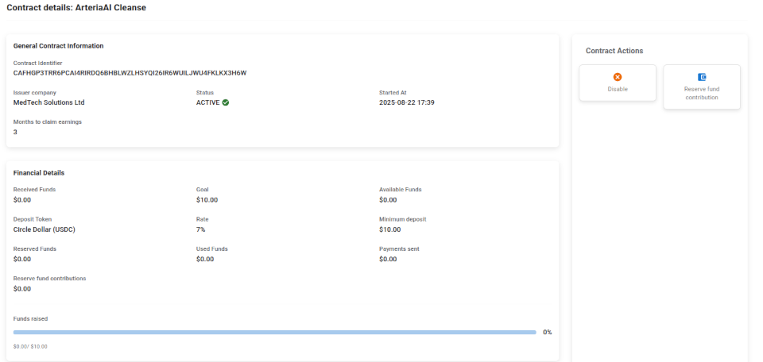

The contract information page now shows the contract ID which is the contract identifier in the Stellar blockchain. Furthermore, the contract is now in the "ACTIVE" status and we also can see the activation date.

### The Investor projects list

As there is already a contract enabled and waiting for capital contributions, let's log into the platform as an investor so that we can connect our wallet and invest on the project. To log as an investor, use the following credentials: *peter.parker@investor.com / investor1*. It will redirect to the current projects where the investor can invest.

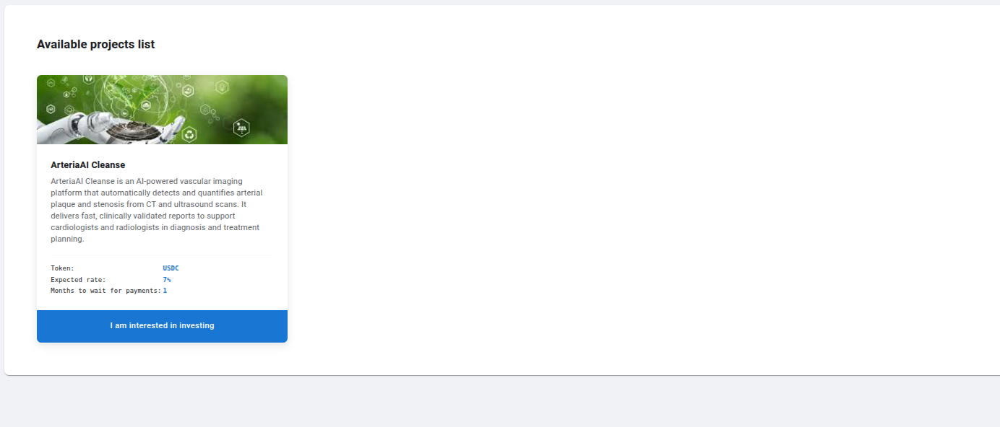

Click on the project you've just been activated and you will be redirected to the project investment page. The first you will see is a modal dialog informing you that you must connect your wallet before investing.

### The project investment page

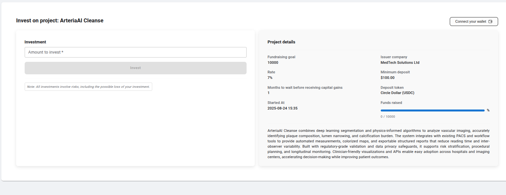

Click on the button named "Connect your wallet" and choose the wallet yur are going to use from the list.

> This project has been tested only with the Stellar Freigther Wallet. You can use another wallet of the list but it may not work. 

Follow the wallet instructions to connect the app with it. Then, you will see a modal that informs you that the system is checking whether you have enougth balance (in the contract token) to invest in the project. If you do not have enougth balance, you will be informed about the issue and the Investment button will be disabled. Otherwise, the modal will inform you that you can invest.

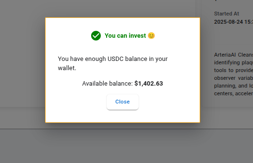

Now you know you can invest, enter the amount you want to invest in the "Investment" field and click on the Invest button. This will open your wallet so that you can review and sign the transaction. Follow the wallet instructions.
After signing the transaction, the wallet will be closed and you will see a loader informing you that the capital contribution is being processed and it can take a few seconds. Then, if everything goes fine, you will see a modal informing you that the deposit has been successfully processed.

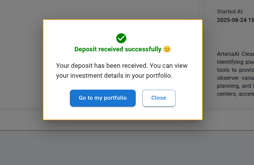

### The Investor porfolio

Click on the "Go to my portfolio" button and you will be redirect to your portfolio page.

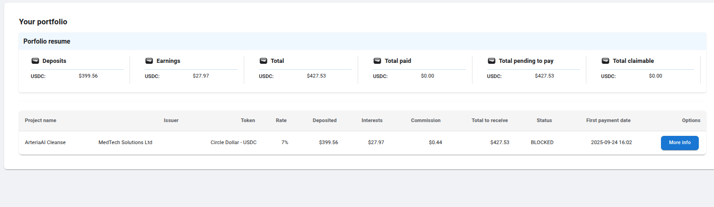

Let's explore the portfolio page. First of all, we can see the porfolio resume that shows us the following fields:

- **Deposits**: It shows the total that the investor has deposited in all their projects (Grouped per token)
- **Earnings**: It shows the earnings (capital gains) that the investor will receive from all their investments (Grouped per token)
- **Total**: It shows the total amount (Deposits + capital gains) that the investor will receive from all their investments (Grouped per token)
- **Total Paid**: It shows the amount that the investor has been received so far (Grouped per token).
- **Total pending to pay**: It shows the pending amount that will be send to the investor (Grouped per token).
- **Total claimable**: It shows the amount which has passed the blocking time specifed by the contract (Grouped per token).

> **(Grouped per token)**: It means that, if the user has been invested in projects with different currencies (USDC, EURC ...), the totals will be calculated per token.

Bellow the porfolio resume, you can see a list of the investor investments. So far, there is only one. The table shows us the following data:

- **Project name**: Project's name.
- **Issuer**: Projects issuer company.
- **Token**: Stellar token by which the contract will receive the deposits.
- **Rate**: The interest rate.
- **Deposited**: The amount deposited by the investor.
- **Interests**: The capital gains that the investor will earn.
- **Comission**: The platform commission for this investment.
- **Total to receive**: The total amount to receive (Deposited + capital gains) for this investment.
- **Status** The investment status.
- **First payment date**: The estimated date when the investor will receive the first payment.

#### What about if you have invested in projects with different tokens ?

In this case, the portfolio resume clearly groups the amounts relating to capital, capital gains and commissions as you can see in the next image:

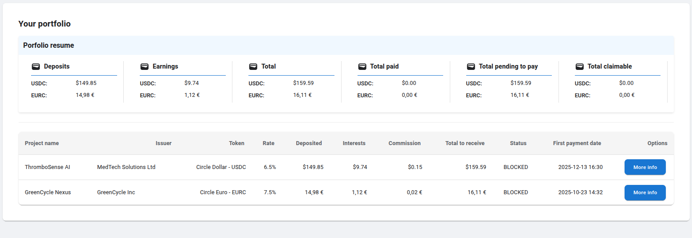
  
### The investment details and payment calendar page

At the end of the investment row, we can see a "More Info" button. Click on it so that we can go to the investment page.

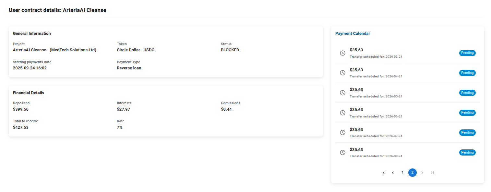

This page shows us the investment data and a calendar showing all the payments that the investor will receive and their estimated payment dates. As we cannot receive any payment yet, all of them are pending.

### The contract financial information

As the contract has already been received the first deposit, let's analyze its financial information again. To do that, logout from the platform and log-in again as a company. Then, go back to the contract information and look at the financial information section.

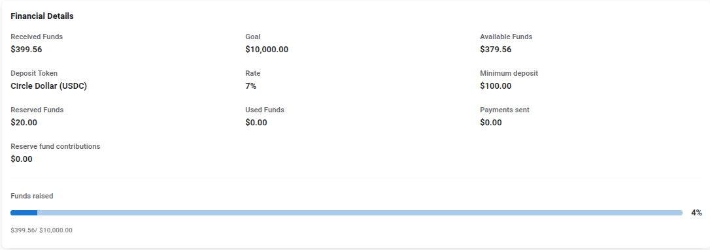

As you can see, the financial information has changed because of it's first received deposit. Let's analyze some relevant data:

- **Received funds**: It shows the funds that the contract has received so far. The user sent a deposit of 400$ but the received funds are 399.56$ because of the platform commission.
- **Available funds**: This is the amount from which the company can request a withdrawal. This is lower than the received funds since a 5% of each investor deposit is transferred to a reserve fund to guarantee the investor payments.
- **Reserve funds**: This is the amount transferred to the reserve fund from the first deposit. (5% of 400$ -> 20$).
- **Used funds**: This is the total company requested withdrawal amount.
- **Payments sent**: This is the total sent in payments to the investors.
- **Reserve fund contributions**: This is the total amount transferred from the company to the contract reserve fund to guarantee the investors payments since the 5% of each deposit cannot guarantee them by itself.

Bellow the previous data, you can see a progress bar that indicates how far is the contract from its fundraising goal.

### Requesting a withdrawal

Having received a deposit, the company can request a withdrawal so that it can start to use the contract funds for the project. To do that, we must click on the "Request funds withdrawal" button from the Contract Actions in the contract information page. After clicking, you will see the following dialog:

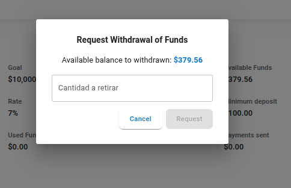

Enter the amount you want to request (not more than the available that is indicated above) and click on the "Request" button. The modal will show a message informing that the withdrawal has been requested. Now, click on the "Withdrawal Requests" link of the side menu and you will see the following page:

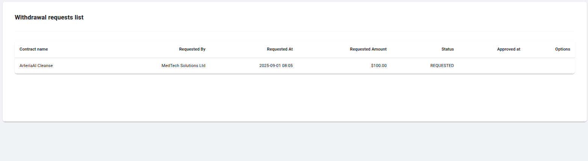

As you can see, it shows the requested withdrawal which is in the "REQUESTED" status. Now, the platform administrator must approve or reject the withdrawal. Let's approve it. Logout and log-in as an administrator and click on the "Withdrawal Requests" link from the side menu. You will see the same request but with two available options: Approve and reject. Click on the "Approve" button and the following dialog will be prompted:

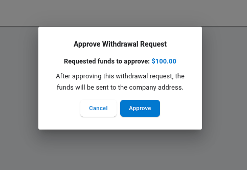

Click on the "Approve" button and, after a few seconds, the funds will be sent to the company address (the address that the company entered on the form when it created the contract). Close the modal after the process finishes and you will see that the withdrawal request is in the "FUNDS SENT" status. Check the company funds in your Freigther wallet and check that you have 100$ more in the USDC company balance.

### Contributing to the reserve fund

Companies can contribute to the reserve fund so that they can ensure that the investor payments will be guaranted. To do that, as a company user, go to the contract details and click on the "Reserve fund contribution" action. You will see the following dialog.

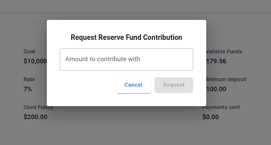

Enter the amount you want to contribute with and click in the "Request" button. Then, you will see the following dialog that informs you about how to send the transfer to the platform:

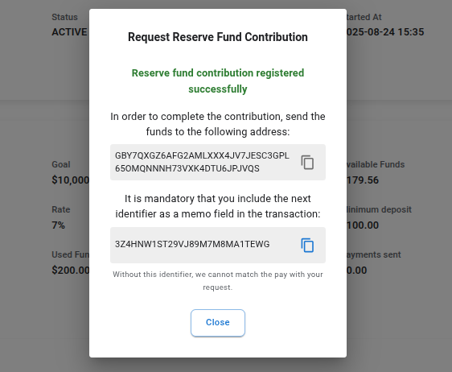

The dialog shows us the address where we have to transfer the funds and an identifier to use as a memo so that the platform can identify the contribution and route the transfer to the right contract. Now, use your freigther wallet to send the transfer.

After sending the transfer, log-in as administrator and go to the Reserve fund contributions list where you will see a list with the Reserve contributions list. At te moment, there is only one reserve fund contribution. Click on the "Check" button so that we can check if the payment has been received. If so, you will see a modal like this:

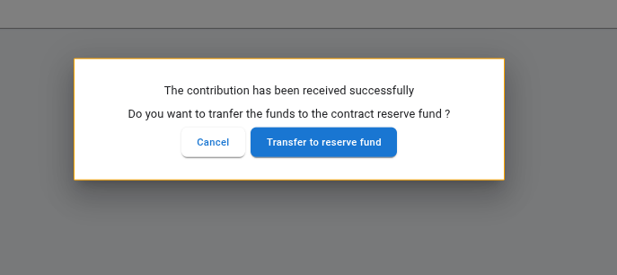

The modal informs us that the payment has been received and offers us the option of transferring the funds to the contract. Click on the "Transfer to reserve fund" button and wait until the process is completed. Then, the modal will inform you that the funds has been transferred. Close the modal and the list will be reloaded. After reloaded, you will notice that the contribution is now in the "TRANSFERRED" status and the button options do not appear.

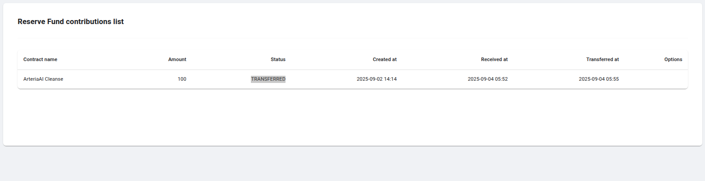

### Moving available funds to the reserve

This is another option that companies have available to contribute to the reserve fund. This way is easier and faster that the contributing way we've explored in the previous section but it involves reducing the available capital that the company can use. When using this option, funds are simply moved from one segment of the contract balance (available segment) to the reserve fund, which is actually another segment of the contract balance. There is no movement of funds in any other direction.

To use this option, go to the contract details page as a company user and click on the "Move funds to the reserve" action. It will show you a modal like the following:

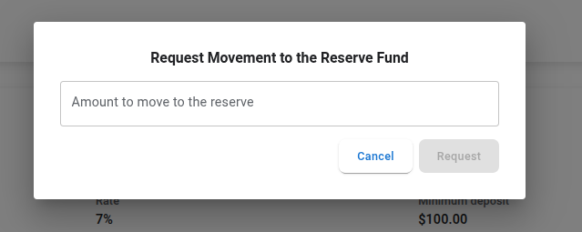

Enter the amount you want to move (no more tha the amount available) and click on the "Request" button. After processing the request, the modal will inform you it's been created and you can go to the "Contract balance movements" from the side menu for listing the balance movements. Close the modal and click on that menu option and you will see the movements list. As you can see, the options column is empty. This is because only admin roles can confirm the movements (that is, change the balance's segments in the contract). That said, let's log back in as an administrator and return to the movement list. Now, you will see the same list but with an option to move de funds permanently.

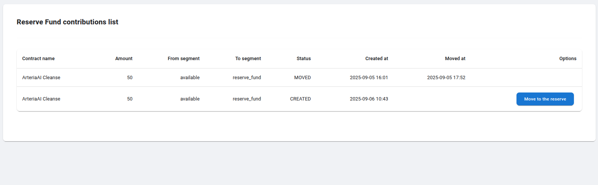

> Notice that only the movement row which is in the "CREATED" status has the "Move to the reserve" button. This is because the other one has already been moved and cannot be moved twice.

Let's go now to process the movement, that is, to changes the balances permanently. To do that, click on the "Move to the reserve" button and you will see the following modal:

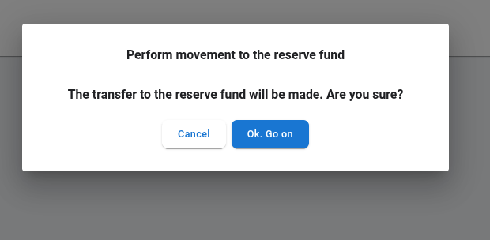

Click on the perform button and, after a few seconds, the process will terminate and you will see that the modal confirms you that now the balance movement is permanent. Close the modal and you will see in the list that your movement is now in the "MOVED" status. Now, if you go to the contract details page, you will notice that the "Reserved funds" has been increased.