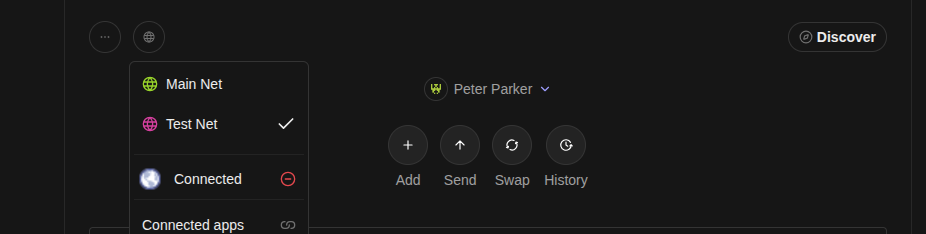
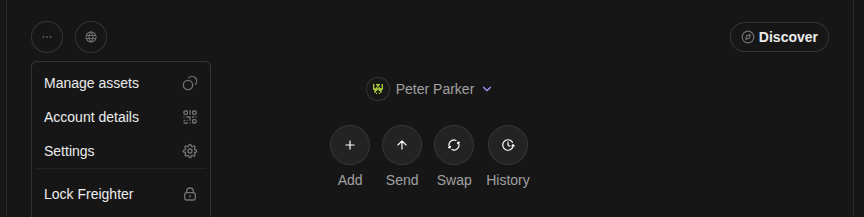
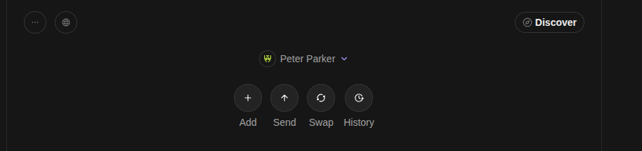
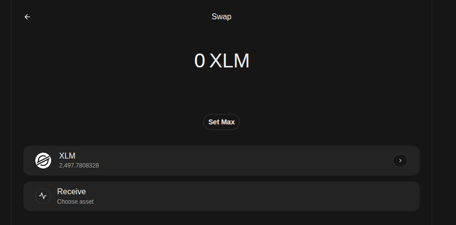
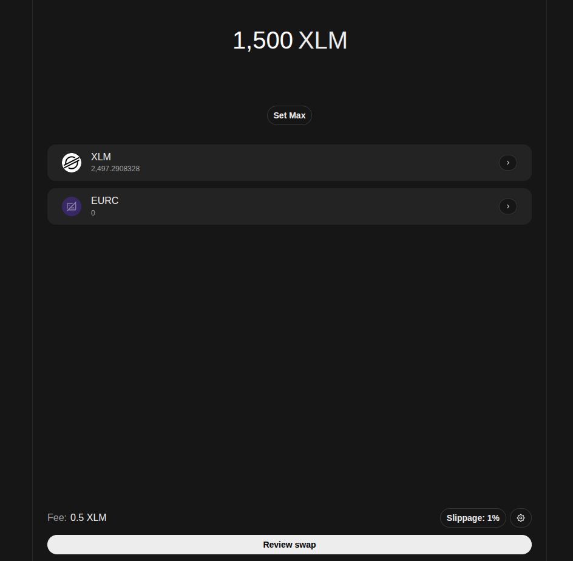

## Freigther Wallet Installation

At the moment, this platform requires that the user has installed a wallet supporting soroban contracts interaction. The most common wallet for interacting with soroban is the [Freigther wallet](https://www.freighter.app/) and it is the wallet which has been used to test this applicaton. This section will guide you about how to, after installing freigther as an extension in your browser, add the assets used in this platform (USDC and EURC) and make an XML - USDC / EURC swap so that you can get funds in these tokens.

### Install Freigther

To install Freigther, go to the link: https://www.freighter.app/, click on the "Add To browser" button and follow the wallet instructions.

### Check you are connected to testnet

After finishing the installation and log-in the first time, you will notice that your account has no XML yet. If you are connected to testnet you will see a message informing you that you can fund your account with XLM using the FriendBot. 
First of all, let's ensure you are connected to testnet.

As you can see in the image, click on the second rounded button and make sure that the selected network is testnet. After checking it, fund your account with FriendBot and it will send 10000 XLM to your account.

### Add a new asset

Now, let's add a new asset so that we can receive tokens from that asset.

> Internally, Freigther creates a Trustline between your account and the token of your choice. You can find more information about what a trustline is in the [stellar docs](https://developers.stellar.org/docs/learn/fundamentals/transactions/list-of-operations#set-trustline-flags).

To add a new token, click on the first rounded button on te top left corner and then click on the "Manage Assets" option.

This will list your current assets. In the bottom, you will see an button named "Add an Asset". Click on that button and enter the Asset ID or Soroban Contract ID of the token you want to add:

- For Testnet USDC: CBIELTK6YBZJU5UP2WWQEUCYKLPU6AUNZ2BQ4WWFEIE3USCIHMXQDAMA
- For Testnet EURC: CCUUDM434BMZMYWYDITHFXHDMIVTGGD6T2I5UKNX5BSLXLW7HVR4MCGZ

Click on the asset "Add" button and follow the wallet instructions to add the asset. After doing it, freigther will list that asset. 

> If you cannot add the asset using the contract id, use the Assets ID instead:

> - For Testnet USDC: USDC-GBBD47IF6LWK7P7MDEVSCWR7DPUWV3NY3DTQEVFL4NAT4AQH3ZLLFLA5
> - For Testnet EURC: EURC-GB3Q6QDZYTHWT7E5PVS3W7FUT5GVAFC5KSZFFLPU25GO7VTC3NM2ZTVO

### Make a swap to get funds

Finally, in order to get funds in USDC or EURC, we can swap some of our XLM. To do that, click on the Freigther "Swap" button:

Here you have to choose the source asset for the swap. Select XLM and continue. You should see the following page:

Enter the XLM amount you want to swap and choose the receive asset (USDC or EURC). Then, click on the "Review Swap" button you will see at the bottom.

Confirm the swap and, after the swap finishes, you will see that you have already a possitive amount in the asset you swapped with.